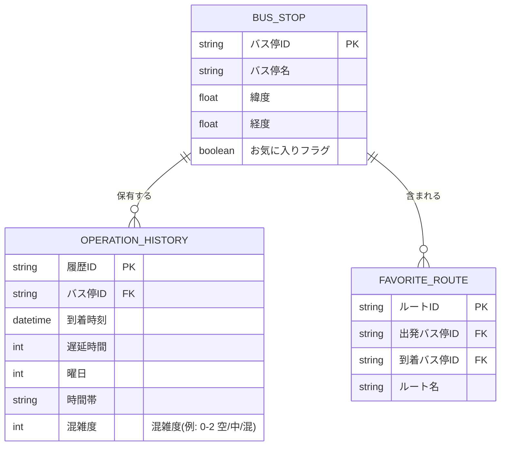

# 5. データ設計

## 5.1 データベース概要
- データベース：SQLite
- 目的：ローカルでの高速なアクセス実現
- 将来的な分析機能追加に備え、必要最小限のデータを保持

## 5.2 ER図

## 5.3 テーブル定義

### 5.3.1 バス停テーブル (BUS_STOP)
バス停の基本情報を管理するテーブルです。お気に入り登録機能も提供します。

| 論理名 | 物理名 | データ型 | NULL | キー | デフォルト | 説明 |
|--------|--------|----------|------|------|------------|------|
| バス停ID | bus_stop_id | string | NO | PK | - | バス停を一意に識別するID |
| バス停名 | bus_stop_name | string | NO | - | - | バス停の名称 |
| 緯度 | latitude | float | NO | - | - | バス停の緯度 |
| 経度 | longitude | float | NO | - | - | バス停の経度 |
| お気に入りフラグ | is_favorite | boolean | NO | - | false | お気に入り登録の有無 |

### 5.3.2 運行履歴テーブル (OPERATION_HISTORY)
バスの運行履歴を記録するテーブルです。遅延情報や時間帯、混雑度情報も保持します。

| 論理名 | 物理名 | データ型 | NULL | キー | デフォルト | 説明 |
|--------|--------|----------|------|------|------------|------|
| 履歴ID | history_id | string | NO | PK | - | 運行履歴を一意に識別するID |
| バス停ID | bus_stop_id | string | NO | FK | - | バス停ID（外部キー） |
| 到着時刻 | arrival_time | datetime | NO | - | - | バスの到着時刻 |
| 遅延時間 | delay_time | int | NO | - | 0 | 遅延時間（分） |
| 曜日 | day_of_week | int | NO | - | - | 曜日（0-6：日-土） |
| 時間帯 | time_period | string | NO | - | - | 時間帯（午前/午後/夜間） |
| 混雑度 | congestion | int | YES | - | NULL | 混雑度（例: 0:空, 1:中, 2:混） |

### 5.3.3 お気に入りルートテーブル (FAVORITE_ROUTE)
ユーザーがよく利用するルートを保存するテーブルです。

| 論理名 | 物理名 | データ型 | NULL | キー | デフォルト | 説明 |
|--------|--------|----------|------|------|------------|------|
| ルートID | route_id | string | NO | PK | - | ルートを一意に識別するID |
| 出発バス停ID | departure_bus_stop_id | string | NO | FK | - | 出発バス停ID（外部キー） |
| 到着バス停ID | arrival_bus_stop_id | string | NO | FK | - | 到着バス停ID（外部キー） |
| ルート名 | route_name | string | NO | - | - | ルートの名称 |

## 補足
- データの永続化はSQLiteを使用し、ローカルでの高速なアクセスを実現
- 将来的な分析機能追加に備え、必要最小限のデータは保持する方針
- データベースのバックアップ機能を実装し、データ損失を防ぐ
- バス停名、路線名での検索パフォーマンス向上のため、`BUS_STOP`テーブルの`bus_stop_name`にインデックスを作成することを検討する。
- `OPERATION_HISTORY`テーブルの`congestion`はリアルタイム情報から取得できる場合に記録する想定。
- 運行会社、路線番号、通過バス停の情報はリアルタイム表示時にAPI等から取得し、履歴DBには保存しない方針。 