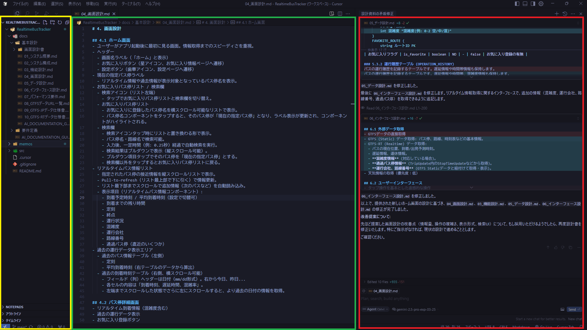
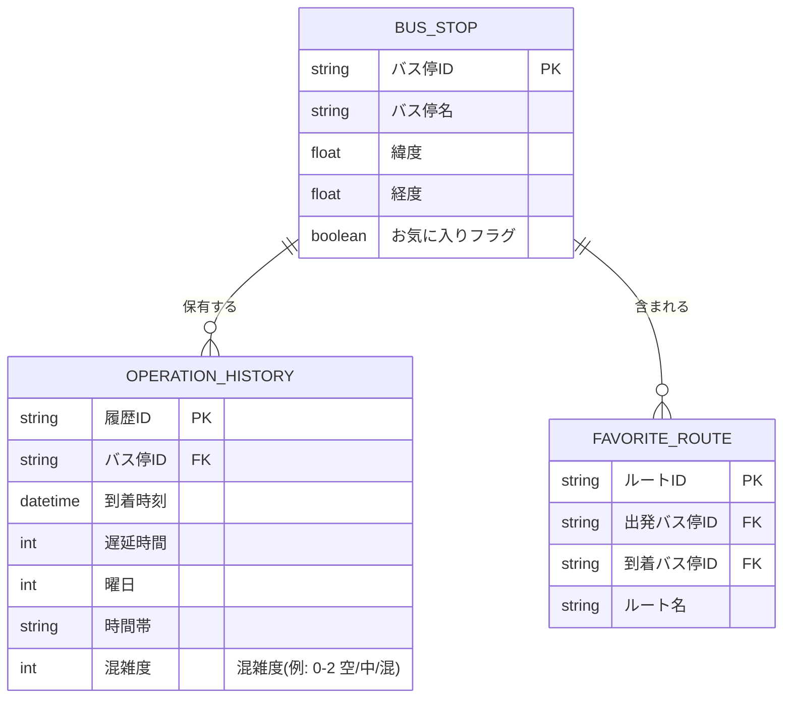

原案
# CursorでAIと共に作る基本設計書

作成中の基本設計書は[Github](https://github.com/thsic/RealtimeBusTracker/tree/main/docs/基本設計)に格納しています。良ければ合わせてご観覧ください。

## 資料概要
Cursorを利用して「AIとの共同作業」をテーマに個人開発を行いました。
その時感じたAIの強み、気をつけるべき部分などをまとめた資料となります。

## 資料作成に用いたツール等
IDE: Cursor
AIモデル: Claude 3.7 Sonnet, Gemini 2.5 Pro

## Cursorとは？
VSCodeをベースに開発されたAI統合型のコードエディタです。コードを自動で推測してくれるCopilotや指示を元にAIが自律的にコードを生成してくれるAgent機能などが備わっています。
無料でも使えますが、しっかり使うのであればPro版がおすすめです。月3000円しますが……。

※ 無料でAI開発を行うのであれば機能的にCursorよりVSCode + RooCodeあたりを触ってみるのが良いと思います

## Cursorの画面


左側にエクスプローラー(黄色枠)、中央にエディタ(緑枠)があり、右側にAIとのチャット欄(赤枠)があります。
チャット欄の下部にはプロンプト入力欄があり、上部にはAIの出力結果が表示されます。
チャット欄でAIに資料作成の内容などを指示すると、それに従って資料を作成してくれます。
基本設計書の作成風景としてエディタで文章を書くことをご想像されるかと思いますが、**実際はエディタで文字を書くことはほぼ無く**、ほとんど全ての作業をチャット欄で行いました。そうしてAIが生成した資料をエディタでレビューするというのが基本的な流れです。

## 環境と方針
AIに適切に資料作成してもらうには**AIにとって都合のいい環境を作ってあげることが大切であると思います**。試行錯誤の中でそれなりに良い方針ができたと思うので共有します。
（AI開発を続けていくうちに変わっていくと思うのですが、とりあえず現状はこんな方針です）

- 情報はできる限りテキスト形式で指示・保存する
    - できる限りマークダウン形式で指示する
    - 生成物はすべてテキスト形式にする
        - 基本的にマークダウン形式で出力する
        - ER図などはMermaidで出力する
        - 画面設計書はhtml + cssで出力する
- 情報がどこにあるかを分かりやすくする
    - フォルダ名とファイル名は内容を明確に表すように命名する
    - ファイルの内容もセクション毎に適切に切り分けることを意識する
- プロンプトは行ってもらいたいことを具体的に書く
    - 参照して欲しい資料があるなら明確にする
    - 具体的な指示が出来ないならAIと一緒に具体案を考える
    - プロンプトが長くなるのは問題ない
- 特に正確性が求められる資料では、生成後に複数回チェックを行う
- 軽微な修正であっても、AIに行わせる
- バージョン管理ツールを使う

## 方針の意図
### 情報はできる限りテキスト形式で指示・保存する
AIはトークンを保持できる量に限りがあり、その上限に近づくと情報の抜け落ちが発生します。
多くの情報を保持するために、トークンに対して情報密度が高い方式でインプットを行うのが望ましいです。

AIに詳しい方であれば、プロンプトはマークダウンで書くことが推奨されることをご存知の方もいらっしゃるかもしれません。
これは、マークダウンは実際にはテキスト形式のため情報密度が高いことに加えて、強調表現やテーブルなどによってtxtファイルよりもAIにとって理解しやすい形で情報を表現できることが理由です。
アウトプットは基本的にマークダウンなので、イン・アウトが統一できる点も嬉しいです。

#### 参考
ER図などもマークダウンで表現することが可能です。
簡単な図ではありますが、私が実際にAIに頼んで生成してもらったものを示します。

---

---

上記の図は実際には下記のテキストによって表現されています。
良ければ画面上部の「Code」ボタンを押して確認してみてください。
```
erDiagram
    BUS_STOP ||--o{ OPERATION_HISTORY : "保有する"
    BUS_STOP ||--o{ FAVORITE_ROUTE : "含まれる"
    BUS_STOP {
        string バス停ID PK
        string バス停名
        float 緯度
        float 経度
        boolean お気に入りフラグ
    }
    OPERATION_HISTORY {
        string 履歴ID PK
        string バス停ID FK
        datetime 到着時刻
        int 遅延時間
        int 曜日
        string 時間帯
        int 混雑度 "混雑度(例: 0-2 空/中/混)"
    }
    FAVORITE_ROUTE {
        string ルートID PK
        string 出発バス停ID FK
        string 到着バス停ID FK
        string ルート名
    }
```

### 情報がどこにあるかを分かりやすくする

### プロンプトは行ってもらいたいことを具体的に書く
プロンプトの参考になるかは分かりませんが、[こちら](バス情報取得アプリ制作.md)にリアルタイムでAIとの格闘の様子を記した記録があります。ほぼ全てのプロンプトの記録を残しているのでよければご参照ください。
ちなみに700行弱あります（！）

### 特に正確性が求められる資料では、生成後に複数回チェックを行う
外部から取得するAPIの資料化で行いました。Webの情報と比較して修正点があれば修正してもらい、ほとんど修正項目が出なくなるまで繰り返します。
Geminiのようなナレッジスコアが高いAIモデルにお願いするのが良いかもしれません。
成果物は以下にて参照できます。
[10_GTFS-RTデータ仕様書.md](/docs/基本設計/10_GTFS-RTデータ仕様書.md)

### 軽微な修正であっても、AIに行わせる
連動して修正が必要な資料の探索や、その後のプロンプトにおいて意図を理解してもらいやすくすることが目的です。

### バージョン管理ツールを使う


## 強み

## 気をつけるべき点

## 総括


## おまけ
### AIモデルの評価
[https://artificialanalysis.ai/models/](https://artificialanalysis.ai/models/)