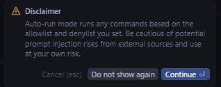
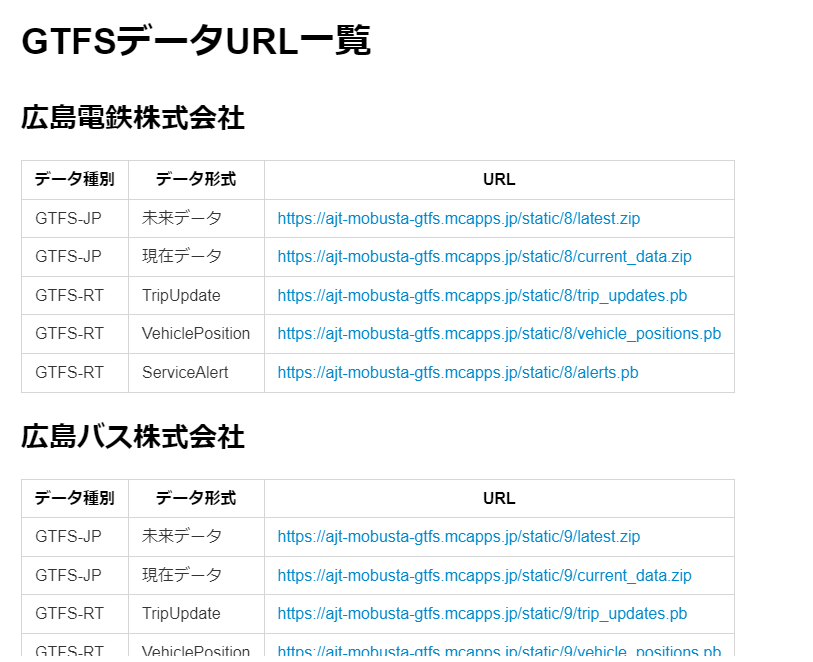
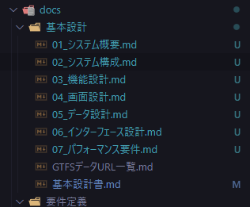
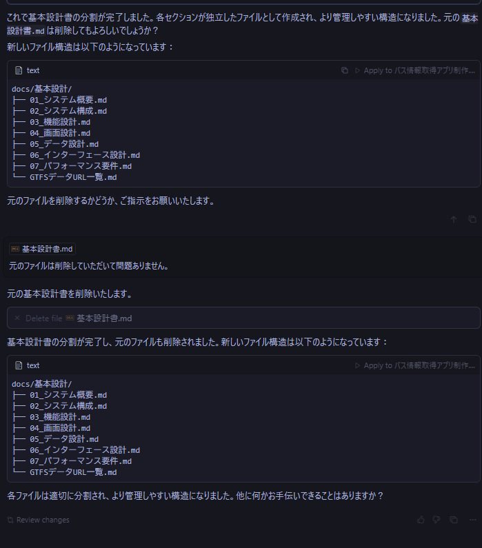

# バス情報取得アプリ制作記録

- 期間: 2025/04/19 - 2025/04/20
- 対応OS: Android
- IDE: Cursor
- AIモデル: Claude 3.5 Sonnet
- 開発言語: TypeScript
- フレームワーク: Ionic, Angular
- データベース: SQLite

# 概要
個人開発モチベーションが出てきたので、AI内蔵IDEであるCursorを使って2日でどこまでアプリを作れるか試してみることにしました。
構想自体は前々からあったので、それを要件定義として起こす部分からスタートしました。

# 作成するアプリの概要
- リアルタイムのバス情報を取得できるAndroidアプリ
- 取得したバス情報はローカルDBに保存され、アプリ内で参照できる

# 基本方針
- 資料作成、設計、コーディング、テスト全てをCursorにて作業を行う
- 資料作成と設計はマークダウンにて管理する
- Auto runモードを利用する
  - ※ユーザの許可無くコードの書き換えやターミナルコマンドの実行をごりごり行っていく恐ろしいモードです。その代わりとても速いです。
  (ワークスペース外のファイルは操作しないよう設定しています）


>　自動実行モードでは、設定した許可リストと拒否リストに基づいてコマンドが実行されます。外部ソースからの潜在的なプロンプトインジェクションのリスクに注意し、自己責任でご利用ください。

時間が足りないので使えるものは使っていく方針です。Continueします。


# 2025/04/19 10:00 ~ 

## 要件定義
Githubリポジトリ作成と連携を済ませ、要件定義書の作成を行います。
なお、資料は全てCursorで作成し、マークダウンで記述します。
（もちろんこの制作記録もCursor + マークダウンで作成しています！）

私が記述した部分です。

```
# バス時刻取得アプリ要件定義

# 背景

- 広島県のバスは渋滞状況によって到着時刻が大きく異なるので、いつ到着するかの目処が付けづらい
- リアルタイムでバス情報を確認できるサイトとして、「くるけん」が存在するが、下記理由からやや不便
    - ブラウザを起動する必要があり、忙しい時は手間に感じる
    - 1つ前までのバス停しか通過した時刻が保持されない
    - 表示される到着予定時刻と実際の到着時刻が大きく異なる時がある

# ニーズ

- 日ごとに到着時刻を記録し、それを元にバス停にいつたどり着ければ間に合うかの指標になるようなデータを表示できるものが欲しい
    - 例えば「以前このバス停に〇〇分に付いているからおそらく到着時刻は〇〇分だろう」「〇〇分についておけばほぼほぼ間に合うだろう」など判断したい
- 忙しい朝でも素早くリアルタイムのバス情報を取得したい
```

これをもとに要件定義書を作成して貰いました。

```
# 機能要件
- リアルタイムバス情報の取得と表示
  - 通過したバス停
  - 到着予定時間
  - 運行状況（遅延、運休など）
- ローカルデータベースによる情報の保存
  - 過去の運行履歴
  - よく利用するバス停の保存
  - お気に入りルートの保存
- 検索機能
  - バス停名での検索
  - 路線名での検索
- お気に入り機能
  - よく利用するバス停の登録
  - よく利用するルートの登録

# 非機能要件

## 1. パフォーマンス
- データ取得は操作から1.5秒以内
- リアルタイムバス情報表示はアプリ起動から2秒以内
- 集積したバス情報表示はアプリ起動から4秒以内

## 2. ユーザーインターフェース
- シンプルで直感的な操作
- ユーザーがよく使う機能を目立たせる

## 3. ユーザーエクスペリエンス
- 画面起動からバス情報表示までは0~1タップ
- 集積したバス情報表示はアプリ起動から0~2タップ
```

出力された機能要件は2日間では無理そうだったので半分ぐらい削りましたが、それ以外の内容はほぼ変えていません。
非機能要件に関しては私が拘りたかったので8割ぐらい書き換えています。

# 2025/04/19 12:00 ~ 

## 基本設計
AIさんに基本設計書を書いてもらいます。面倒なのでファイル設置も依頼します。
```
要件定義書をもとに、基本設計書を作成してください。ファイル設置場所は要件定義と同様の構造にしてください。
```

データの取得URLも資料化してもらいます。
```
@https://www.bus-kyo.or.jp/gtfs-open-data にアクセスし、「広島電鉄」と「「広島バス」のGTFS-JPの取得URLとGTFS-RTの取得URLをテーブルとして記載してください。
ファイルは他の資料と同様の構造にして配置してください。
```


いい感じです。

出力された基本設計書は1ファイルにまとまっていて見づらく感じたので分割を依頼します。
```
基本設計書の各項目をそれぞれ別ファイルに分割してください。
```


元のファイルを削除するかどうか聞いてくれました。いろいろありがとうございます。



