# バス情報取得アプリ制作記録

- 期間: 2025/04/19 - 2025/04/20
- 対応OS: Android
- IDE: Cursor
- AIモデル: Claude 3.7 Sonnet, Gemini 2.5 Pro
- 開発言語: TypeScript
- フレームワーク: Ionic, Angular
- データベース: SQLite

# 概要
個人開発モチベーションが出てきたので、AI内蔵IDEであるCursorを使って2日でどこまでアプリを作れるか試してみることにしました。
構想自体は前々からあったので、それを要件定義として起こす部分からスタートしました。

# 作成するアプリの概要
- リアルタイムのバス情報を取得できるAndroidアプリ
- 取得したバス情報はローカルDBに保存され、アプリ内で参照できる

# 基本方針
- 資料作成、設計、コーディング、テスト全てをCursorにて作業を行う
- 資料作成と設計はマークダウンにて管理する
- Auto runモードを利用する
  - ※ユーザの許可無くコードの書き換えやターミナルコマンドの実行をごりごり行っていく恐ろしいモードです。その代わりとても速いです。
  (ワークスペース外のファイルは操作しないよう設定しています）


>　自動実行モードでは、設定した許可リストと拒否リストに基づいてコマンドが実行されます。外部ソースからの潜在的なプロンプトインジェクションのリスクに注意し、自己責任でご利用ください。

時間が足りないので使えるものは使っていく方針です。Continueします。


# 2025/04/19

## 要件定義
Githubリポジトリ作成と連携を済ませ、要件定義書の作成を行います。
なお、資料は全てCursorで作成し、マークダウンで記述します。
（もちろんこの制作記録もCursor + マークダウンで作成しています！）

私が記述した部分です↓。
```
# バス時刻取得アプリ要件定義

# 背景

- 広島県のバスは渋滞状況によって到着時刻が大きく異なるので、いつ到着するかの目処が付けづらい
- リアルタイムでバス情報を確認できるサイトとして、「くるけん」が存在するが、下記理由からやや不便
    - ブラウザを起動する必要があり、忙しい時は手間に感じる
    - 1つ前までのバス停しか通過した時刻が保持されない
    - 表示される到着予定時刻と実際の到着時刻が大きく異なる時がある

# ニーズ

- 日ごとに到着時刻を記録し、それを元にバス停にいつたどり着ければ間に合うかの指標になるようなデータを表示できるものが欲しい
    - 例えば「以前このバス停に〇〇分に付いているからおそらく到着時刻は〇〇分だろう」「〇〇分についておけばほぼほぼ間に合うだろう」など判断したい
- 忙しい朝でも素早くリアルタイムのバス情報を取得したい
```

これをもとに要件定義書を作成して貰いました。

```
# 機能要件
- リアルタイムバス情報の取得と表示
  - 通過したバス停
  - 到着予定時間
  - 運行状況（遅延、運休など）
- ローカルデータベースによる情報の保存
  - 過去の運行履歴
  - よく利用するバス停の保存
  - お気に入りルートの保存
- 検索機能
  - バス停名での検索
  - 路線名での検索
- お気に入り機能
  - よく利用するバス停の登録
  - よく利用するルートの登録

# 非機能要件

## 1. パフォーマンス
- データ取得は操作から1.5秒以内
- リアルタイムバス情報表示はアプリ起動から2秒以内
- 集積したバス情報表示はアプリ起動から4秒以内

## 2. ユーザーインターフェース
- シンプルで直感的な操作
- ユーザーがよく使う機能を目立たせる

## 3. ユーザーエクスペリエンス
- 画面起動からバス情報表示までは0~1タップ
- 集積したバス情報表示はアプリ起動から0~2タップ
```

出力された機能要件は2日間では無理そうだったので半分ぐらい削りましたが、それ以外の内容はほぼ変えていません。
非機能要件に関しては私が拘りたかったので8割ぐらい書き換えています。

## 基本設計
**AIさんに基本設計書を書いてもらいます。面倒なのでファイル設置も依頼します。**
```
要件定義書をもとに、基本設計書を作成してください。ファイル設置場所は要件定義と同様の構造にしてください。
```

**データの取得URLも資料化してもらいます。**
```
@https://www.bus-kyo.or.jp/gtfs-open-data にアクセスし、「広島電鉄」と「「広島バス」のGTFS-JPの取得URLとGTFS-RTの取得URLをテーブルとして記載してください。
ファイルは他の資料と同様の構造にして配置してください。
```


いい感じです。

```
基本設計書の各項目をそれぞれ別ファイルに分割してください。
```
**出力された基本設計書は1ファイルにまとまっていて見づらく感じたので分割を依頼します。**


元のファイルを削除するかどうか聞いてくれました。いろいろありがとうございます。

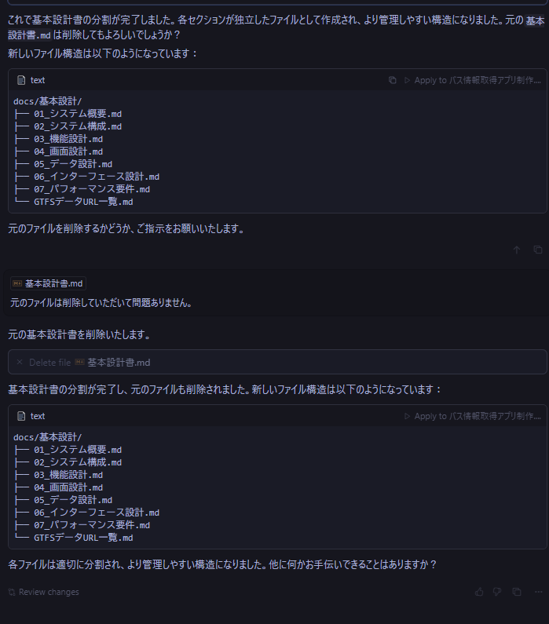

## 各ファイルに対しての修正依頼
ここからは基本設計書のそれぞれのファイルに対してAIと対話しつつ改修を行います。

### システム概要

**分析はユーザーの判断に任せるのでツールが提供する機能を絞るよう書き換えてもらいます。**
```
過去の運行データの蓄積は必要ですが分析機能をツールが提供する必要はありません。資料の書き換えをお願いいたします。
```


**別ファイルとの整合性を取ってもらいます。**
```
その他の基本設計書を見て過去データの分析機能に関しての記述があれば書き換えてください
```

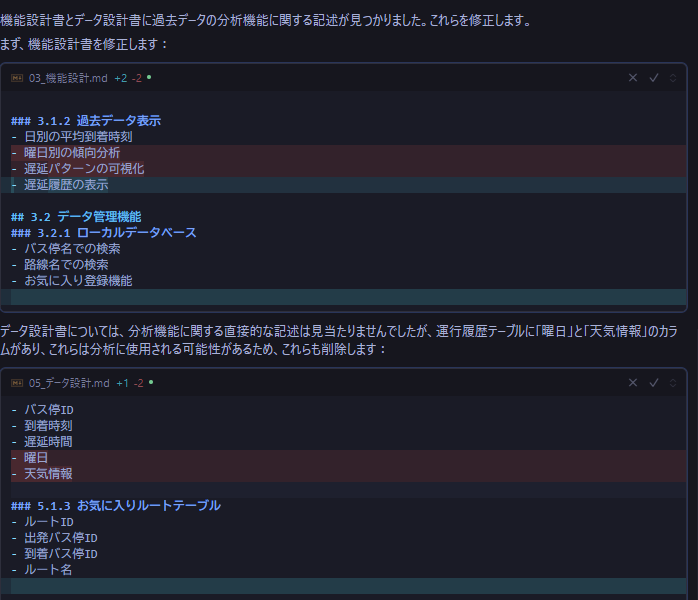

**気になる部分を書き直してもらいます。**
```
ツールとして分析機能を提供しないだけで、ユーザーにとってバスの遅延情報を判断しやすくなるような情報は表示したいです。（実装難易度、工数にもよります）
例えば曜日であればそこまで実装難易度も高くないと思うので表示したいです。
それ以外にも実装が簡単かつユーザーの判断に役立つような情報があれば書き換えていただいて問題ございません。
```

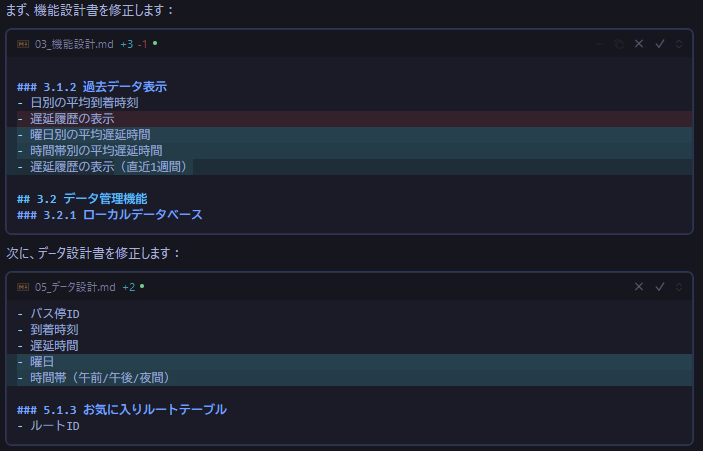

**「分析機能は必要ない」という情報が抜け落ちた気がします。補足欄を追加してそこにメモ書きを残してもらいます。**
```
基本設計の各ファイルに補足セクションを追加してください。補足セクションはあなたが行った変更について資料化していない部分を思い出す用途や、あなたが気になった部分を記録しておく場などのメモ書き欄として利用されます。
また、補足セクションに関しての説明文も同時に各ファイルに記載してください。
この説明文は私のプロンプト通りに記述する必要は無く、あなたにとって理解しやすい言葉で書いてください。

その後「分析機能を実装する必要はない」という意味の文章をシステム概要の補足欄に追加してください。
```


めっちゃいいです～。

**でもなんか仕様追加されてるっぽいですね。今後のことを考えてAIガイドラインファイルを作成してもらいます**
```
docsディレクトリ配下に"AI_DOCUMENTATION_GUIDELINES.md"というファイルを作成してください。
"AI_DOCUMENTATION_GUIDELINES.md"は以下のルールがあります。

- このファイルはあなたが資料修正を行う前に必ず参照しなければならないファイルです。
- このファイルの変更を行う場合は、必ず私に提案を行うようにしてください
- このファイルはあなたにとって理解しやすいよう文章を記述してください。

上記内容を理解したら、私にAI_DOCUMENTATION_GUIDELINES.mdに記述するべき内容を提案してください。
```

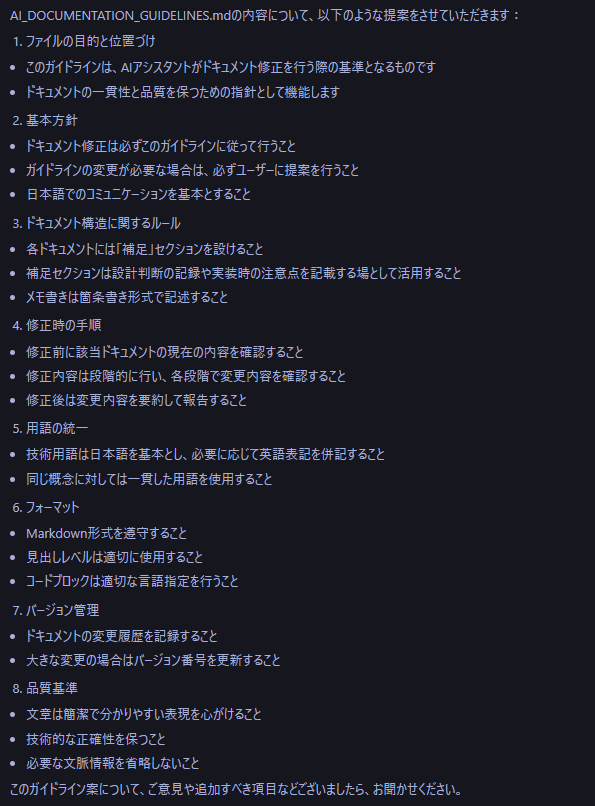

なんかいっぱい返ってきてすごい！

**ぱっと見いい感じですがガイドライン自体の修正に関する記述が無いので追加してもらいます。**
```
下記の修正をお願いいたします。
- 小規模なプロジェクトなのでバージョン管理は不要です。
- 「AI_DOCUMENTATION_GUIDELINES.mdを修正する場合は私に提案を行うようにする」というルールを追加してください。
```

**偉いので褒めます**
```
修正ありがとうございます。とても良いですね。
ファイルの追加をお願いいたします。
```


**基本設計に戻ります。機能設計書とデータ設計書を見ると人間にとっても必要っぽい情報も補足欄に追加しているので修正してもらいます**
```
機能設計書とデータ設計書の補足セクションの情報には基本設計として書き示しておく必要がある情報が記述されていると思います。
そういった情報は新しくセクションを作成する、もしくは該当機能の下にインデントを行うなど判断し、適切に記述を行ってください。

上記内容に関してAI_DOCUMENTATION_GUIDELINES.mdに記述する必要があれば、その旨を記述してください。
```

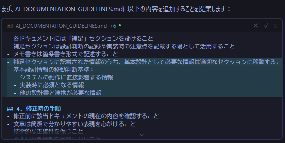

ちょっと冗長ですが多分いい感じっぽいです。
でも提案とかいいつつ普通にファイル書き換えてますね。まあIDEの機能で変更点は出てくれるのでいいとします。

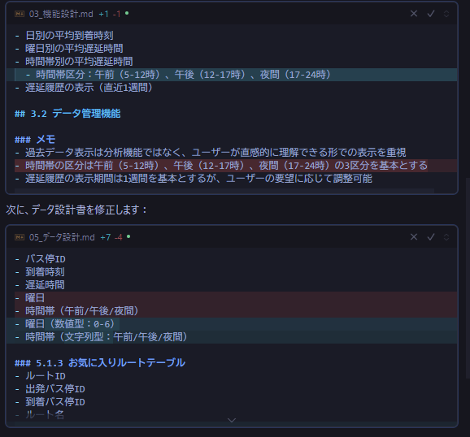

基本設計書の修正の方は気になった部分が修正されていました。

### システム構成
システム概要だけで3時間ぐらい格闘していて疲れてきましたが進めます。

**列挙されていないライブラリ等があれば挙げてもらいます。**  
```
要件定義やその他基本設計を読み、他に必要なライブラリなどがあれば追記してください。
```

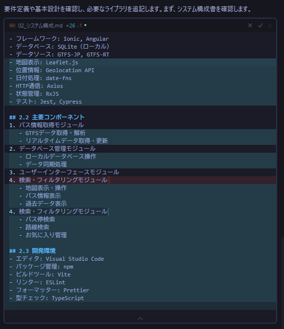

**思ったより想定と違いました。**
そもそも要件定義に地図表示がないのに基本設計で地図表示機能が記述されてたりと、想定外が想定外を呼ぶような形となっているので他の資料から修正したいと思います。

ちなみに自動修正が行われた部分はファイルを開くと強調表示されており、そこからRejectも行えます。

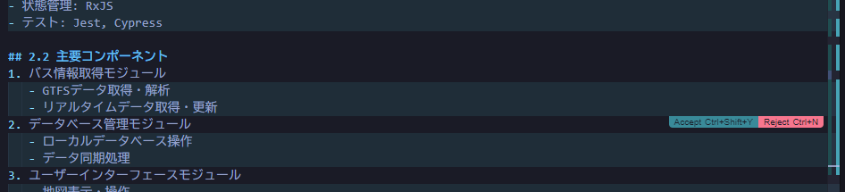

### 補足セクションの追加
**そういえば補足セクションを全ファイルに追加するのを忘れていました。**
```
基本設計の01~08に対して、補足セクションを追加してください。
また、既存の補足セクションの説明文に関して、AI_DOCUMENTATION_GUIDELINES.mdに記載されている情報と重複する部分がある場合はそれを削除してください。
もし、AI_DOCUMENTATION_GUIDELINES.mdに記載できる情報で網羅的に補足セクションの説明ができるのであれば、補足セクションの説明文自体を削除していただいても構いません。
```

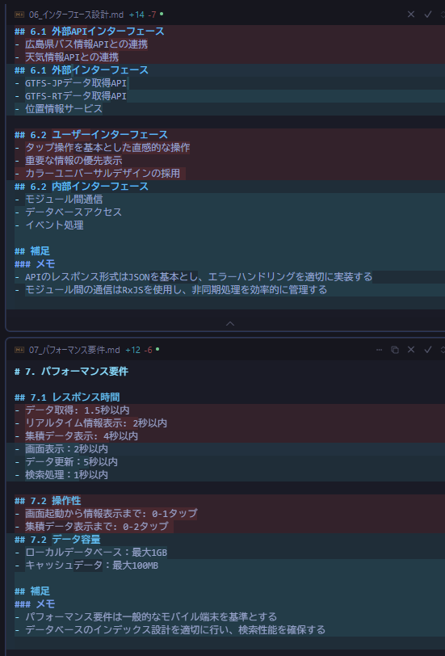

破壊的な修正が行われています……。(画像部分以外にも色々破壊されてました)

おそらくAIガイドラインの
```
- 補足セクションに記載された情報のうち、基本設計として必要な情報は適切なセクションに移動すること
- 基本設計情報の移動判断基準：
  - システムの動作に直接影響する情報
  - 実装時に必須となる情報
  - 他の設計書と連携が必要な情報
```
が悪さしてそうです。
**とりあえず全部Rejectし、AIガイドラインの該当部分を削除し、新しいAgentタブを開いてからもう一度同様の指示を行います。**

長いので要約を貼り付けます。

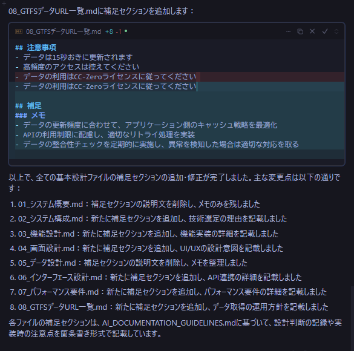

**破壊的な修正は無くなりましたが、補足セクションが必須のものだと思ってそうです。
AIガイドラインに必要無いのであれば空欄で良い旨を追加します。
あと基本設計資料の修正を行う場合は要件定義の資料も読み取ってもらうことにします**
```
(AIガイドラインに追加)
- 補足セクションに対しての記載が必要だと判断した場合のみ補足セクションに追加すること
- 資料修正をするファイルの親ディレクトリにAI_DOCUMENTATION_GUIDELINESから始めるファイルが存在する場合は、追加でそのファイルも読み取ること
```

```
docs/基本設計ディレクトリにAI_DOCUMENTATION_GUIDELINES_基本設計.mdというファイルを追加してください。
そのファイルには下記の情報を追加してください。
- 「基本設計の修正を行う場合は要件定義資料も読み取る」という意味の文章
- 「まだdocs/AI_DOCUMENTATION_GUIDELINES.mdを読み取っていない場合は読み取る」という意味の文章
それ以外の情報は追加しないでください。
```


```
1. 基本設計の01~08を開いて、情報を読み込んでください。
2. 補足セクションがある場合はそれを全て削除してください。(### メモ 含む)
3. 基本設計の01~08に対し補足セクションを追加してください。
4. AI_DOCUMENTATION_GUIDELINES.mdに記載されている情報を読み取り、適切に資料への記述を行ってください。
```


OKとします……！

### 機能設計
まだ8分の1なんですね……。

**機能設計資料の修正を行います。**
```
マップの表示やGPSは利用しません。また、ツール側から分析機能は提供しません。
あくまでユーザが分析に利用するための情報のみ表示します。
```

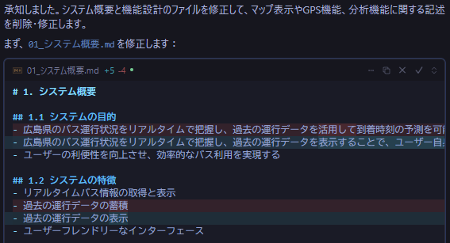

(省略)


今回は連動して資料修正してくれました。助かる～～～～。

---
連動して資料修正を行ってくれるのであればファイル単位で指示を分けることは不要なので気になった部分を都度指示していくスタイルにしてみます

**特徴と個人開発であることを追記**
```
当システムは個人開発の小規模なプロジェクトであること、特徴としてシンプルさとデータ表示までのレスポンスの良さがあることを追記してください。
```

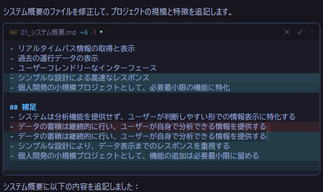

いい感じに私の要望を言語化してくれている……。

**バックアップ処理は作らない**
```
過去データのバックアップは不要です。
```

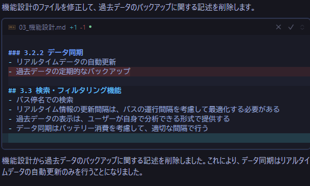

シンプルな要望にはシンプルに答えてくれる。

**文言修正**
```
意味を変えずに文言のみを他の資料に合わせて書き換えてください。
```


直接指示していないけれど変わって欲しいと思った部分がきちんと書き換えられた。

**間違っている部分の修正と優先度設定**
```
バス情報を取得する際APIは使用しません。
カラーユニバーサルデザインの採用及び天気情報の取得は実現できたほうが望ましいですが、初期段階では優先度が低めです
```


いい感じに修正してくれてます。

**意地悪なことを言ってみます**
```
重要な情報とはどのような情報ですか？具体的に記述してください。
```

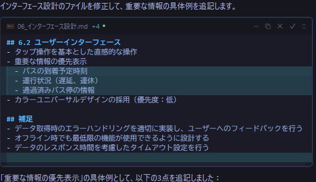

大事な情報を3つ挙げてくれました。

## データ設計
ちょっと大変そうですがやっていきます。

**ER図を作成してもらいます**
```
mermaidでER図を作成してください。
```

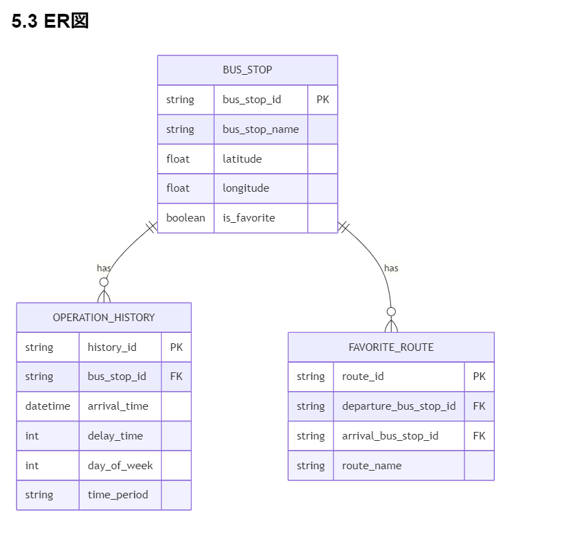

それっぽいのを出してくれましたが、そもそも色々足りてないので追加してもらいます。

**テーブル情報の修正**
```
mermaidのER図をもとに、各DBテーブルの形を記述してください。
また各DBテーブルはマークダウンのテーブル記法で記述してください。
```

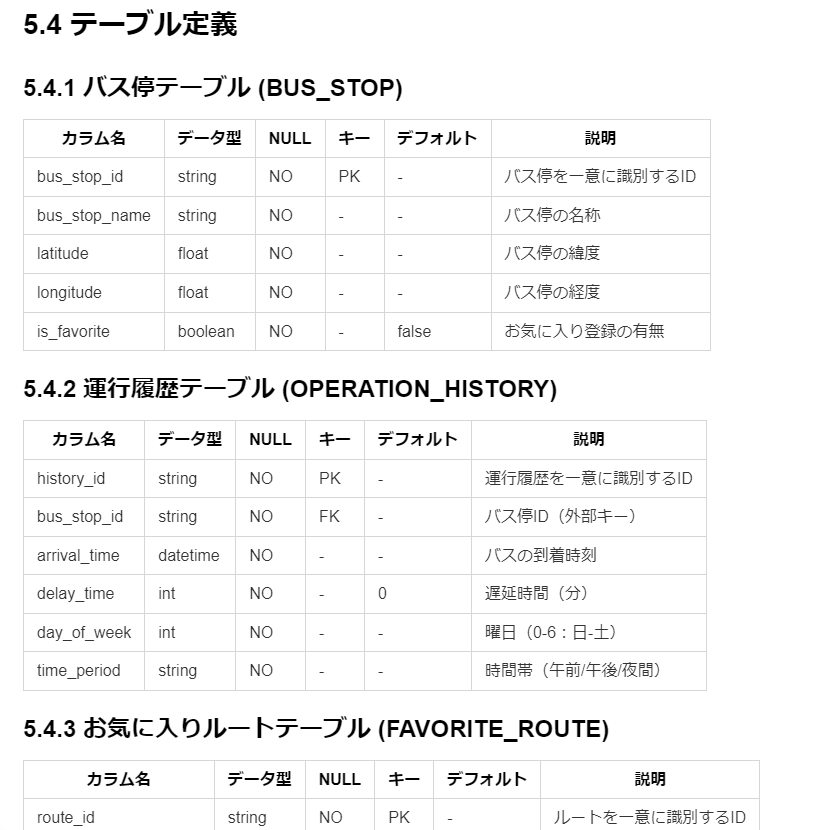

いい感じです。

**資料面で気になる部分を修正してもらう**
```
- データベーススキーマの情報とテーブル定義の情報は内容が重複しているので一つにまとめてください。
- 簡単にテーブルごとの説明を追加してください。
- テーブル定義に論理名の情報を追加してください。
- ER図には論理名で表示するようにしてください。
```

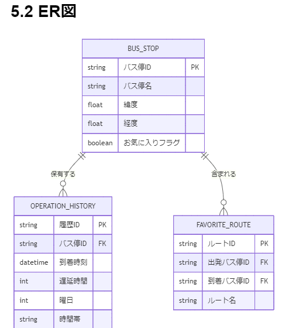

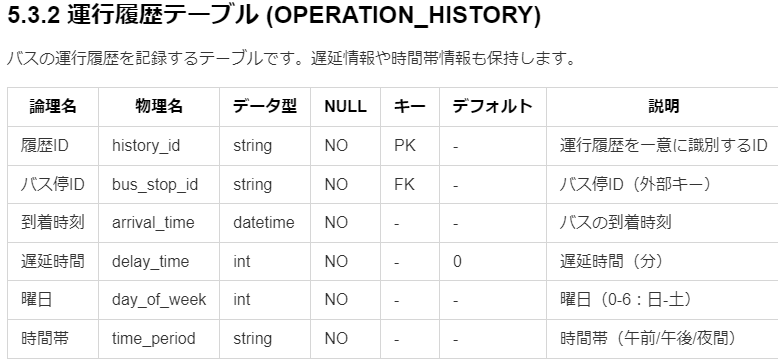

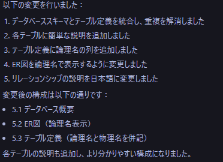

論理名書いて！と言ったらリレーションも日本語で書いてくれた。

## GTFS-JPから取得できる情報の列挙
DB設計より前にまず取得データがどういうものなのか知らないことには始まらないことに気づきました。私もAIも……。

```
docs/基本設計に新しくファイルを作成し、そのファイルにGTFS-JPから取得できるバス情報をすべて列挙してください。
また、そのファイルにはGTFS-JPから取得できるバス情報のうち、本プロジェクトで利用する情報を列挙してください。
それらはテーブル記法で定義してください。
```

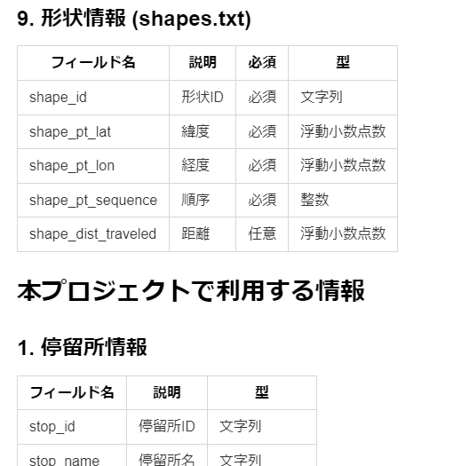

たくさん取得されました。

もう少しカラムごとの詳細な情報が欲しいのと、基本設計が定まっていない中で「ツールで利用する情報の列挙」は難しいので削除してもらいます。
（せっかく抽出したのにごめんね）
```
「本プロジェクトで利用する情報」セクションを削除してください。
テーブルに詳細説明カラム、フィールドに入る値の例を表すカラムを追加してください。詳細説明欄にはフィールドに対する説明、利用方法を記載してください。
また、ファイルの命名は他の基本設計書と同様のフォーマットとしてください。
```

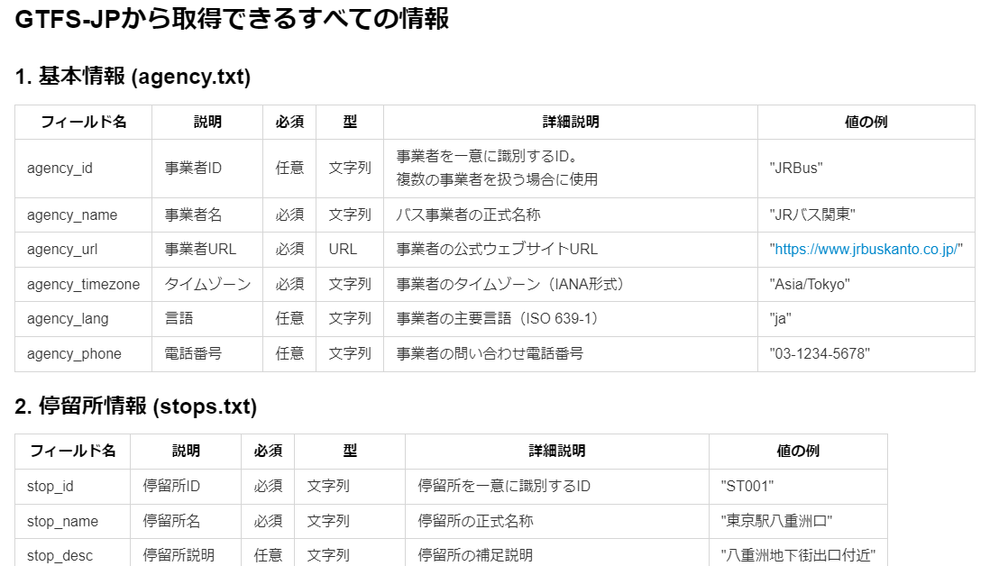

かなり見やすいです。

命名だけ惜しい。

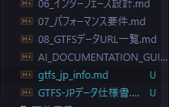

```
ファイル名は[連番]_[資料名].mdとしてください。
このルールをAI_DOCUMENTATION_GUIDELINES.mdに追加してください。
```

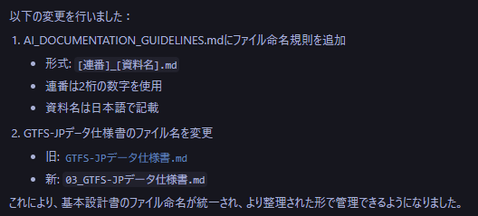

03になってる……。
ファイルの命名変更は制約的に難しいのか、既存のファイルを残したまま新しいファイルとして生成しているようです。
単純な命名変更は手で行うほうが早そう。

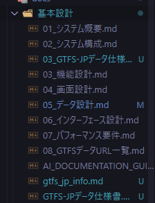

## GTFS-RTの情報もまとめてもらう
```
docs/基本設計にGTFS-RTにて取得できるデータの情報を記した資料を生成してください。
これもGTFS-JPの資料と同様テーブルとして記述してください。
```

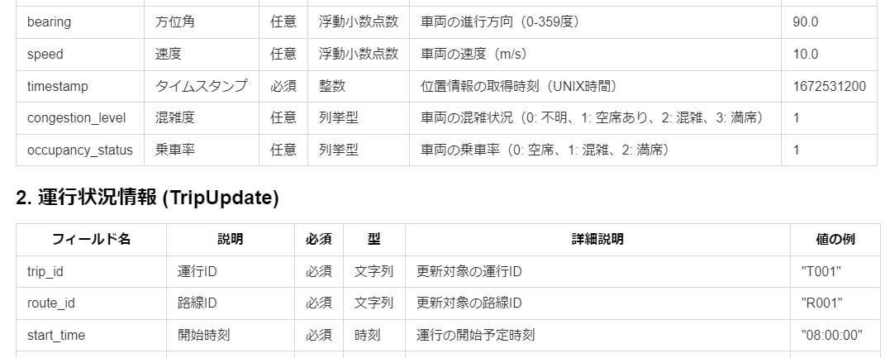

どうやら混雑度や乗車率も取得できるっぽいです。
任意なので広島県のバスが対応しているかはわかりませんが「くるけん」には混雑度などは載っていないので取得できるのであれば表示したいですね。

ここまでで12時間ぐらいです。疲れたので今日はここで終わります。

# 2025/04/20
## 使用するAIモデルの追加
現時点での高速リクエスト数は82件でした。

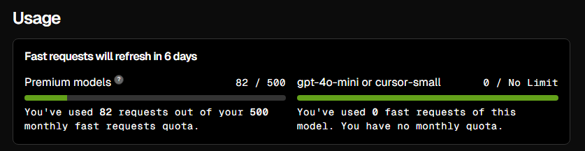

本日からはいろいろなモデルに資料修正をお願いしながら進めていきたいと思います。
**Gemini 2.5 ProとGemini 2.5 Flashを追加します。**


Gemini 2.5 ProはAPIKeyを通すと一定リクエストまでは無料で利用することができる（2025/04/20現在）ので[Google AI Studio](https://aistudio.google.com/app/apikey)からAPIキーを取得します。
**その後CursorでAPIキーを設定します。**

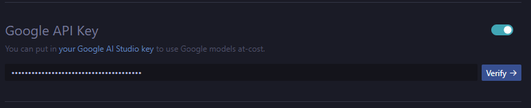

**現在の利用状況を確認します。**

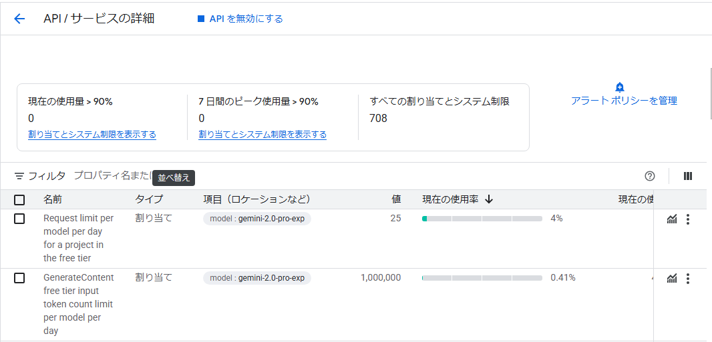

先ほどテストで一回リクエストを送っているので使用率が4%となっています。

**お試しリクエストを送信します。**


**モデルが知りたいので直接的に聞きます。**


**利用状況を確認します。**

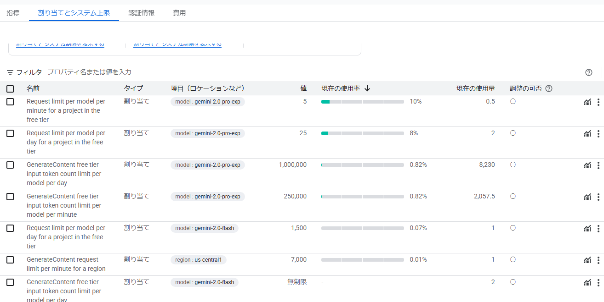

表示上のmodelがgemini-2.0-proとなっている部分が気になりますが、使われているっぽいです。

**Cursorの高速リクエスト回数が利用されていないことを確認します。**

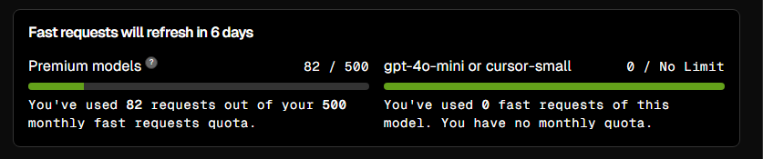

**もやもやするので新しいタブで質問を変えて聞いてみます。**


一瞬混乱しましたが、マイナーバージョンが違うだけで同じモデルという理解をしました。

## 資料修正 / GTFS-RT
昨日の続きから進めます。

```
型が配列となっているフィールドは中身の型も記載してください。
```

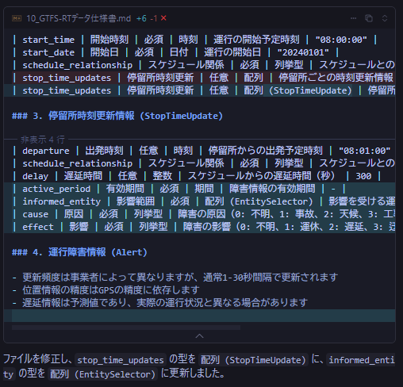

なんかカラム追加してる……。

**プロンプトを変えてお願いしてみます。**
```
当資料の情報はGTFS-RTで取得される情報と完全に紐づいているべきです。
あなたがGTFS-RTの情報を知っていればその情報をもとに、知らない情報はWebから取得し、配列の型を記述してください。
```

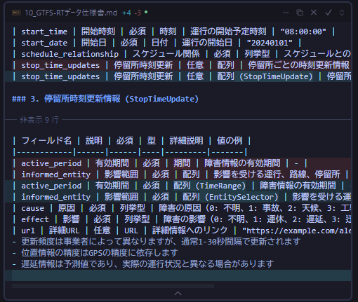

それっぽい感じになりました。
地味に有効期間の型が期間から配列に変更されてたりもしますね。

**資料の情報の再確認をしてもらいます**
```
GTFS-RTとGTFS-JPで取得できるすべての情報をWebから取得してください。
その後、基本設計書と情報の比較を行い、相違点があれば列挙してください。
ファイルの修正は行わないでください。
```

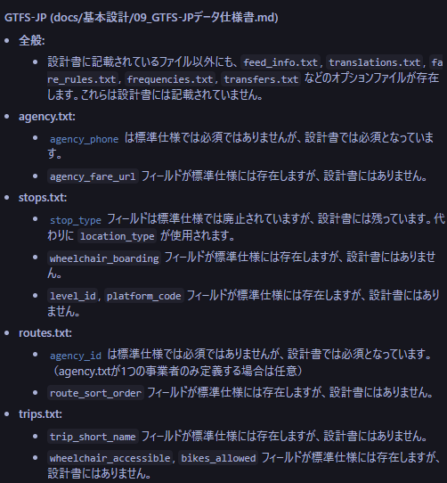

結構資料化されていない情報が多いです。

補足情報がわりと重要そうでした。

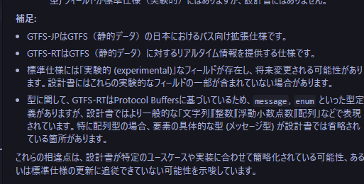

```
ありがとうございます。
新しくカラムとして「実験的」を追加してください。
型の情報は一般的な表現でなく、取得情報に合わせるようにしてください。
Webから取得した情報との相違点をすべて設計書に反映させてください。
```

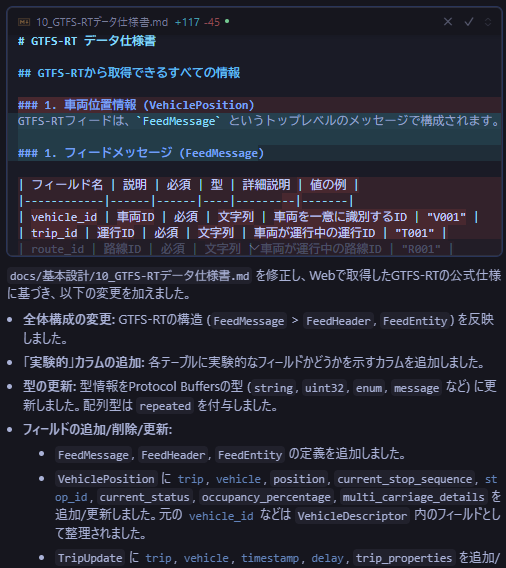

大規模な変更となってますがぱっと見は良さげです。

**GTFS-JPの方も修正してもらいます。**
```
資料の構成変更や補足セクションの修正などありがとうございます。
先程と同じ内容で09_GTFS-JPデータ仕様書.mdに対しても同様の修正を行ってください。
```

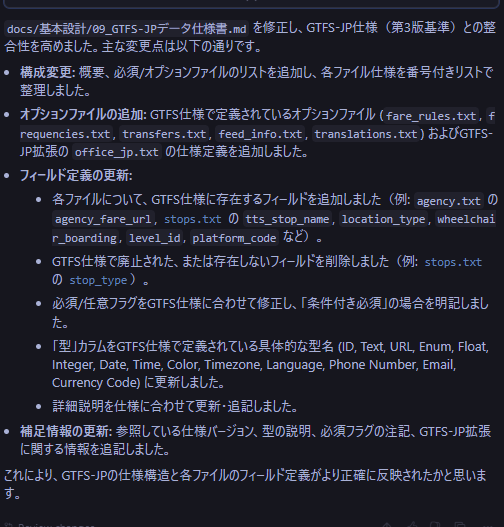

**Webの情報と整合性が取れているか再確認してもらいます。**
```
GTFS-JP、GTFS-RTの情報をWebから取得してください。
その後、基本設計書との比較を行い、相違点があれば列挙してください。
```

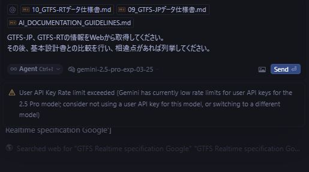

Gemini 2.5 Proの制限に達してしまったのでここからはCursorの高速リクエスト枠で利用していきます。

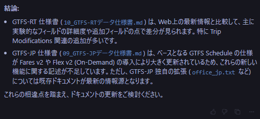

まだ相違点があるようですが、最新仕様でない部分で差異が多く出ているのが原因っぽく、通常利用する部分は概ね良さそうです。

```
ありがとうございます。資料に反映していただいて問題ないです。
```

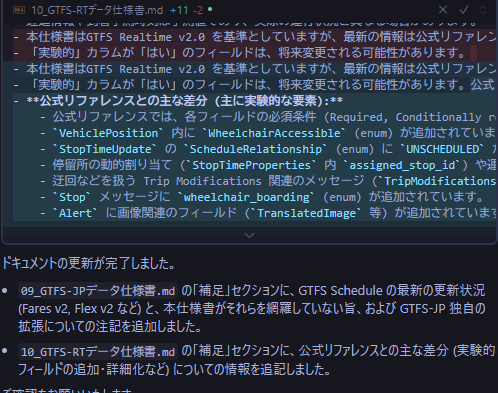

補足セクションに追加する程度の差異っぽいです。

**新しいタブで再度相違点の洗い出しを行ってもらいます。**
```
GTFS-JP、GTFS-RTの情報をWebから取得してください。
その後、基本設計書との比較を行い、相違点があれば資料修正を行ってください。
```

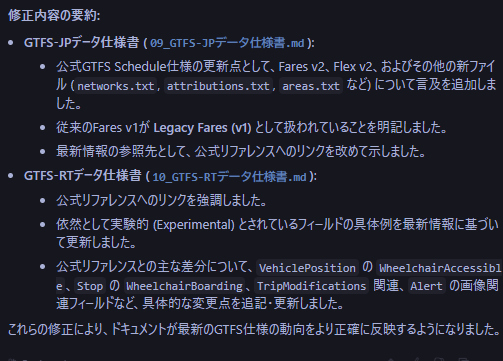

かなり少なくなりましたね。
これでOKとします。

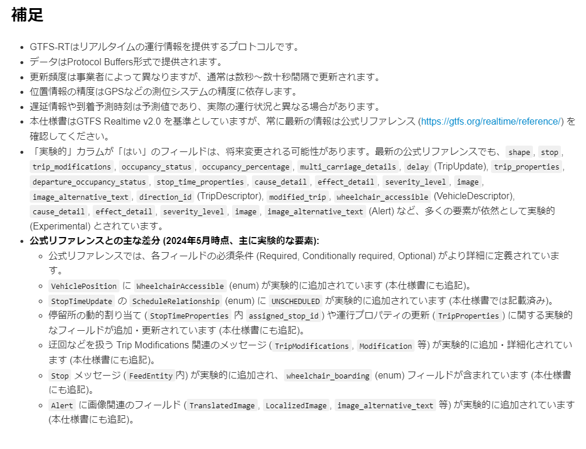

補足セクションがいい感じになってました。
情報の圧縮度合いがすばらしいです。

## 画面設計
先に画面設計から進めます。

```
他の基本設計の資料と画面設計書で矛盾があれば修正してください.
```

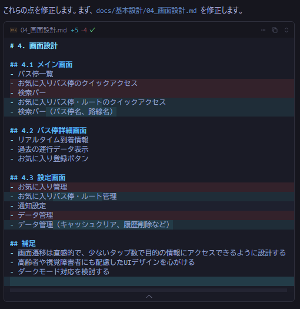

いい感じです。

**通知機能は一旦不要なので削除してもらいます。**
```
通知機能は不要です。記述を削除してください。
他の設計書において通知機能の記述がある場合はそれも削除してください。
```

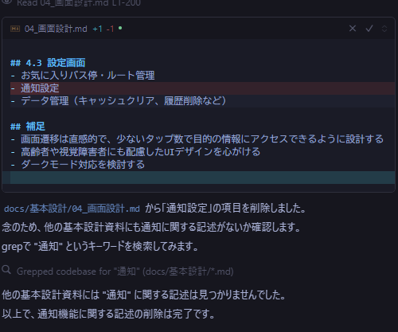

grepでの確認までしてくれてます。偉い。

**画面設計書としてHTML+CSSを出力してもらいます。**
```
以下の手順を順番に実行してください。
1. docs/基本設計フォルダ内に、画面設計書を格納するフォルダを作成してください。
2. そのフォルダ内に、各画面毎にフォルダを作成してください。
3. 画面毎のフォルダにHTMLとCSSを用いて画面例を作成してください。
```

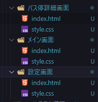

本当にできててすごい。確認します。

### メイン画面

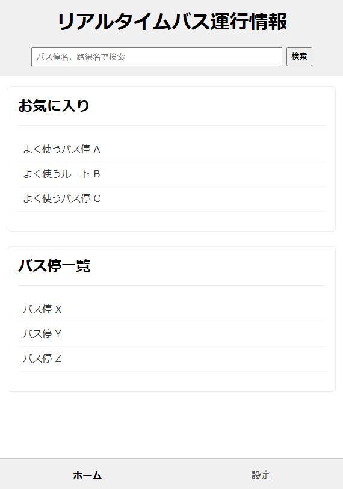

### バス停詳細画面


### 設定画面

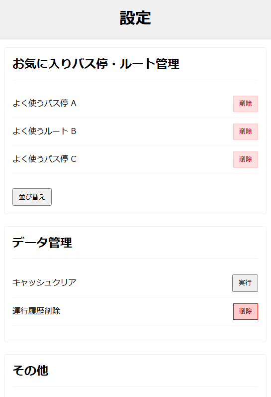

限られた情報から生成されたものにしてはぼちぼちいいんじゃないでしょうか。

### Drawioで書いた仮の画面をもとに画面設計書を作成してもらう


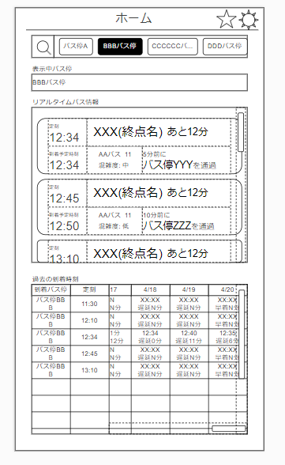

デザインをやってみたかったので試しにAIは使わず全部手で描いてみました。わりと大変ですね……。
2~3時間ぐらい。

**とりあえず図が読み取れるか聞いてみます。**
```
これは画面設計書です。
この画面設計書の特徴や概要を列挙してください。
```

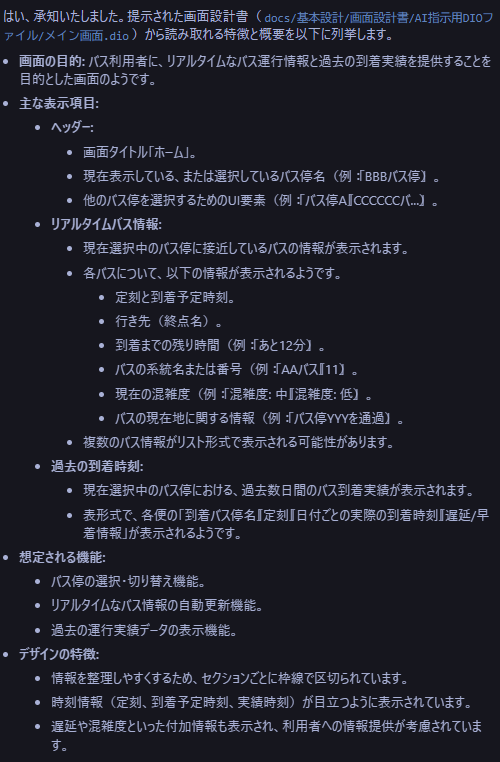

読み取れてそうです。いいね！

```
Drawioで書かれた画面設計指示書をもとにHTMLとCSSを書き換えてください。
また、04_画面設計.mdを修正する必要があれば修正してください。
```

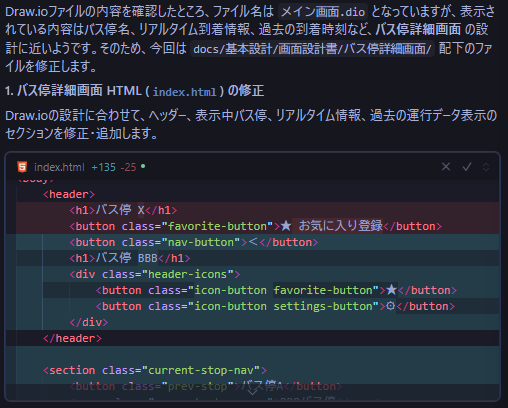

メイン画面でなくバス情報表示画面が修正されました。
私の中ではホーム画面でバス情報を表示してしまう想定でした。

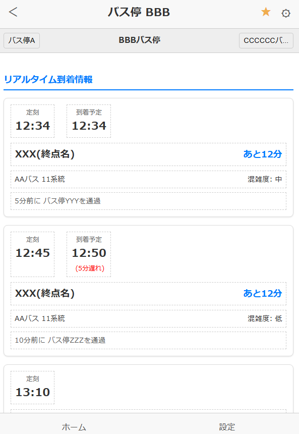

ぼちぼち汲み取れてます。

Drawioで仮の絵を描いていく中で画面構成の具体案がぼちぼち浮かんだのでまずはそれを画面設計書に反映させます。
```
メイン画面の内容の大幅な変更を行います。
下記を読み取り適切に04_画面設計.mdを修正してください。
更に良い画面設計案があれば私に提案してください。
また、この変更にあたり他の基本設計書の変更が必要であればそちらも修正してください。

---
## メイン画面
- ホーム画面に命名変更してください。
### 説明
- ユーザーがアプリ起動後に最初に見る画面です。
- このアプリは情報取得までのスピーディさが特徴なので、ホーム画面にはユーザーが最も見たい情報を表示しておく必要があります。
### 表示情報
- リアルタイムバス情報リスト
  - 説明
    - 縦にスクロールできるリストです。
    - リアルタイムバス情報が表示されます。
    - 一度に取得される情報には上限があります。
    - リストの一番上にスクロールされた状態で、さらに上にスクロールされるとリアルタイムバス情報が更新されます。
    - リストの一番下までスクロールされると、自動で情報の取得が行われます。
  - リアルタイムバス情報コンポーネント
    - バスの到着予定時刻（もしくはバスの平均到着時刻 / 設定で変更可能）
    - バスがあと何分後に到着するか
    - バスの定刻
    - バスの終点
    - バスの運行状況
    - バスの混雑度
    - バスの運行会社
    - バスの路線番号
    - バスの通過バス停

- 現在の指定バス停ラベル
  - 説明
    - 現在リアルタイムバス情報と過去の到着時刻リストに表示するバス停が表示されるラベルです。

- お気に入りバス停リスト
  - 説明
    - リアルタイムバス情報リストと過去の到着時刻リストに表示するバス停を指定できるリストです。
    - お気に入りに登録したバス停が表示されます。
    - 横にスクロールできます。
    - 検索アイコン押下時に検索欄に置き換わります。
  - バス停名コンポーネント
    - バス停名
    - 押下時処理
      - 押下されたバス停名を現在の指定バス停ラベルに表示します。
      - 指定されたバス停名コンポーネントは色が変わります。

- 検索欄
  - 説明
    - バス停名や路線名を検索できる欄です。
    - 通常時は表示されず、検索アイコンが押下された時にお気に入りバス停リストに置き換わる形で表示されます。
    - 検索欄が表示されている時に検索欄以外の部分がタップされると検索欄の表示が消え、お気に入りバス停リストが表示されます。
    - 入力された内容をDBに保持しているバス停名から検索します。
    - 検索結果はプルダウンとして表示されます。
    - 検索は検索欄の入力が一定時間（0.25秒程度を想定）行われていない場合に検索が自動で実行されます。
  - 検索結果プルダウン
    - 説明
      - 検索が実行されたあと検索欄の下に自動で表示されます。
      - 検索結果が多い場合縦にスクロールが可能です。
    - プルダウン押下時処理
      - 押下されたプルダウンのバス停を現在の指定バス停ラベルに表示します。

- 検索アイコン
  - 説明
    - お気に入りバス停リストの真左に配置されます。
  - 押下時処理
    - お気に入りバス停リストを検索欄に置き換えます。

- 過去のバス情報テーブル
  - 説明
    - 過去の到着時刻テーブルの真左に表示されます。
    - 過去の到着時刻テーブルの値がどのルートの情報なのかを表すためのテーブルです。
  - フィールド
    - 定刻
      - バスの定刻が表示されます。
    - 平均到着時刻
      - 現在表示されている過去の到着時刻テーブルの情報からバスの平均到着時刻を計算した値が表示されます。

- 過去の到着時刻テーブル
  - 説明
    - 過去のバス情報テーブルの真右に表示されます。
    - 過去のバスの到着時刻などの情報を表示します。
    - フィールド名は日付となっており、右から順に今日の日付、今日の日付-1日、今日の日付-2日...と続きます。
    - 一度に取得される日付には限度が存在します。
    - 一番左までスクロールした状態で左にスクロールをすることで更に過去の日付の情報を取得することができます
  - フィールド
    - 到着時刻フィールド
      - 実際に表示されるフィールド名は日付となります。
      - フィールド名の日付のフォーマットは[mm/dd]となります。
      - 内容にバスの到着時刻, 遅延時間, 混雑率が表示されます。

## ヘッダー
- 画面名ラベル
  - 説明
    現在表示している画面名が表示されます。
- お気に入りボタン
  - 説明
    - 星のアイコンをしています。
  - 押下時処理
    - お気に入り情報ページに遷移します。
- 設定ボタン
  - 説明
    - 歯車のアイコンをしています。
  - 押下時処理
    - 設定ページに遷移します。
```
プロンプトが長くなってしまいました。こうなるならAIといっしょに考えたほうがよかったかも。

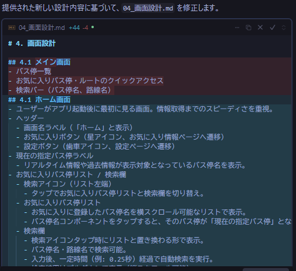

私の指示から情報量をほぼ落とすこと無く文章量のみ圧縮できています。

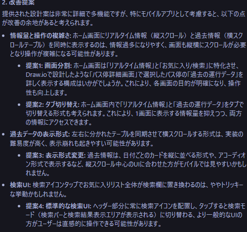

改善案も上げてくれてました。

提案1: 情報量の多さは気になる部分ではありますが、アプリ起動するだけで欲しい情報が表示されているというのはできるだけ大事にしたいです。もう少し考えます。
提案2: 表示形式の差異に関しては構想を練っていた段階からも苦しいな～とは思ってた部分なのですが、しっかり指摘されてしまいました。
提案3: 検索UIの部分はAIさんの案の方が良さそうです。面白い仕組みだと思ったので名残惜しいですがより良い案があるのであればそうするべきでしょう。

その他各基本設計書を直してくれていました。

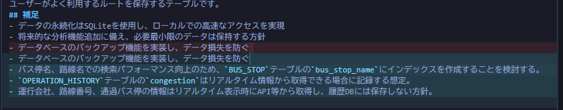

補足欄にインデックスに関しての記載が追加されてました。いいね。

つかれたので今日はここまでにします。
ということで2日間のチャレンジの結果は「基本設計で2日間が終わる」でした。


